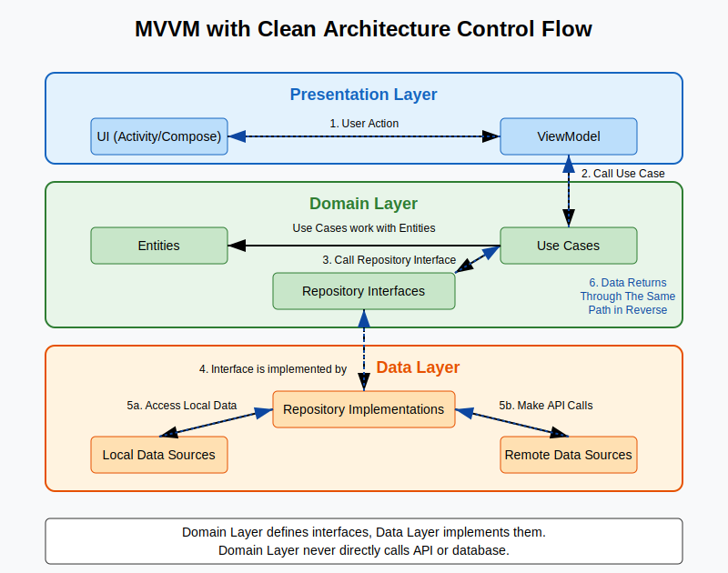
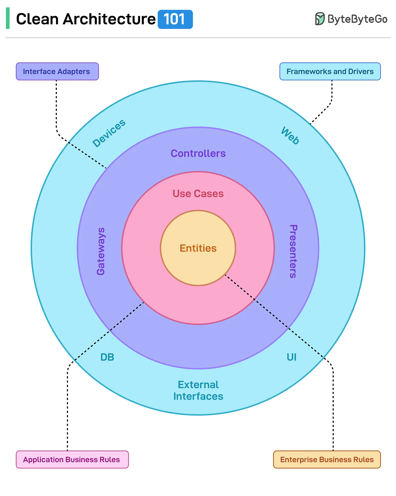

## Memory Optimizations in Android
Taken from here: https://betulnecanli.medium.com/memory-optimizations-in-android-d50f4d1d2d82


## MVP vs MVVM
MVP -> "Presenter commands View"
MVVM ->"View observes ViewModel (acting as Presenter)"

| Feature                       | MVP (Model-View-Presenter)                                   | MVVM (Model-View-ViewModel) using AAC ViewModel                |
| :---------------------------- | :----------------------------------------------------------- | :------------------------------------------------------------- |
| **Core Components** | Model, View, **Presenter** | Model, View, **ViewModel** |
| **Interaction Model** | - **Presenter Commands View:** Presenter tells View *what* to display via specific methods (e.g., `view.showUsers()`, `view.showLoading()`).<br/>- View forwards user events to Presenter. | - **View Observes ViewModel:** View observes data/state streams (`LiveData`, `StateFlow`) exposed by ViewModel and reacts to changes.<br/>- View forwards user events to ViewModel. |
| **Coupling** | **Tighter:** View and Presenter are often tightly coupled (1:1 relationship typical). Presenter needs knowledge of View interface. | **Looser:** ViewModel has no direct reference to the View. View observes ViewModel. Easier to modify/replace View. |
| **View Reference** | Presenter **holds a reference** to the View (usually via an interface). | ViewModel **does NOT hold a reference** to the View.           |
| **Testability (Logic Layer)** | **Good:** Presenter logic is easily unit testable by mocking the View interface. | **Excellent:** ViewModel is highly unit testable as it has no direct dependency on Android framework View/Context (usually). |
| **Boilerplate Code** | **Can be High:** Often requires defining detailed View interfaces and implementing corresponding calls in Presenter for UI updates. | **Can be Lower:** Especially with Data Binding or Jetpack Compose, reducing the need for manual view updates and extensive View interfaces for state. |
| **Configuration Change Handling (Default)** | **State LOST:** Presenter instance is typically destroyed and recreated with the View. Requires manual handling to retain state. | **State RETAINED:** AAC `ViewModel` instance **automatically survives** configuration changes. State is preserved by the framework. |
| **State Retention Techniques** | **Manual Methods Required:** <br/> - **Retained Fragments:** (Now deprecated) Host Presenter in a headless fragment set to retain instance.<br/> - **`onSaveInstanceState`:** Only suitable for small, simple, Parcelable data; not for complex objects or active operations.<br/> - **Custom Scoping/Singletons/Loaders:** Requires complex custom implementation or careful DI scope management. | **Built-in & Recommended:**<br/> - **AAC `ViewModel`:** Handles configuration change survival automatically.<br/> - **`SavedStateHandle`:** Used *within* AAC `ViewModel` to persist state across **process death** (uses `onSaveInstanceState` mechanism internally). |
| **Android Jetpack Integration** | **Lower:** Not directly designed around Jetpack. Can use some components, but core pattern differs. | **Excellent:** Deeply integrated with `ViewModel`, `LiveData`, `StateFlow`, `Lifecycle`, `Data Binding`, `Compose`, `SavedStateHandle`, etc. |
| **Recommendation (as of April 2025)** | Still valid, especially in legacy code or if team prefers explicit style. But generally less favored for new projects. | **Google's Recommended Pattern:** Preferred for modern Android development due to robustness, testability, and Jetpack integration. |

**Key Takeaway for Interviews:**

The most significant practical advantage of MVVM (using AAC `ViewModel`) over traditional MVP in Android is the **built-in, framework-supported handling of configuration changes**, which eliminates a major source of complexity and boilerplate found in MVP state management. This, combined with better testability and alignment with Jetpack, makes MVVM the generally preferred choice today. Explain that while MVP *can* handle state retention, it requires manual, often complex workarounds (like retained fragments, custom scopes) that the AAC `ViewModel` provides out-of-the-box.


## MVC vs. MVP vs. MVVM Comparison for Android Interviews

| Feature                       | MVC (Model-View-Controller) - Android Context              | MVP (Model-View-Presenter)                                   | MVVM (Model-View-ViewModel) using AAC ViewModel                |
| :---------------------------- | :----------------------------------------------------------- | :----------------------------------------------------------- | :------------------------------------------------------------- |
| **Core Components** | Model, View, **Controller** <br/>*(Often View + Controller = Activity/Fragment)* | Model, View, **Presenter** | Model, View, **ViewModel** |
| **Interaction Model** | - Controller (`Activity`/`Fragment`) handles input, updates Model.<br/>- View (`Activity`/`Fragment`) reads Model OR Controller pushes data to View.<br/>- **Tight link between UI code and logic.** | - **Presenter Commands View:** Presenter tells View *what* to display via specific methods (e.g., `view.showUsers()`).<br/>- View forwards user events to Presenter. | - **View Observes ViewModel:** View observes data/state streams (`LiveData`, `StateFlow`) exposed by ViewModel and reacts.<br/>- View forwards user events to ViewModel. |
| **Coupling** | **Very Tight:** View and Controller often the same class (`Activity`/`Fragment`), tightly coupled to Model and Android Framework. | **Tighter:** View and Presenter often tightly coupled (1:1 typical). Presenter needs knowledge of View interface. | **Looser:** ViewModel has no direct reference to the View. View observes ViewModel. Easier to modify/replace View. |
| **Component Awareness** | - Controller (`Activity`) knows Model & View (itself).<br/>- View (`Activity`) knows Model (potentially) & Controller (itself).<br/>- Model knows none. | - Presenter knows View (interface) & Model.<br/>- View knows Presenter.<br/>- Model knows none. | - ViewModel knows Model.<br/>- View knows ViewModel.<br/>- Model knows none.<br/>- **ViewModel does NOT know View.** |
| **Testability (Logic Layer)** | **Poor:** Controller logic within `Activity`/`Fragment` is hard to unit test due to Android framework dependencies. Requires instrumentation tests. | **Good:** Presenter logic is easily unit testable by mocking the View interface. | **Excellent:** ViewModel is highly unit testable as it has no direct dependency on Android framework View/Context (usually). |
| **Boilerplate Code** | Low initial boilerplate, but leads to **Massive Activities/Fragments** that are hard to maintain. | **Can be High:** Often requires defining detailed View interfaces and corresponding calls in Presenter for UI updates. | **Can be Lower:** Especially with Data Binding or Jetpack Compose, reducing the need for view updates and View interfaces for state. |
| **Configuration Change Handling (Default)** | **State LOST:** `Activity`/`Fragment` (View/Controller) is destroyed and recreated. State must be manually saved. | **State LOST:** Presenter instance is typically destroyed and recreated with the View. Requires manual handling. | **State RETAINED:** AAC `ViewModel` instance **automatically survives** configuration changes. State is preserved by the framework. |
| **State Retention Techniques** | **Manual Methods Required:** <br/> - `onSaveInstanceState` (Limited).<br/> - Retained Fragments (Deprecated).<br/> - Custom Scoping/Singletons/Loaders (Complex).<br/> - *Harder due to intertwined logic.* | **Manual Methods Required:** <br/> - Retained Fragments (Deprecated).<br/> - `onSaveInstanceState` (Limited).<br/> - Custom Scoping/Singletons/Loaders (Complex). | **Built-in & Recommended:**<br/> - **AAC `ViewModel`:** Handles configuration change survival automatically.<br/> - **`SavedStateHandle`:** Used *within* AAC `ViewModel` to persist state across **process death**. |
| **Android Jetpack Integration** | **Very Low:** Jetpack (ViewModel, LiveData etc.) was created largely to *solve* the problems of MVC on Android. | **Lower:** Not directly designed around Jetpack. Can use some components, but core pattern differs. | **Excellent:** Deeply integrated with `ViewModel`, `LiveData`, `StateFlow`, `Lifecycle`, `Data Binding`, `Compose`, `SavedStateHandle`, etc. |
| **Recommendation (as of April 2025)** | **Not Recommended:** Leads to poor testability and maintainability ("Massive View Controller"). Suitable only for trivial screens. | Still valid, especially in legacy code or if team prefers explicit style. Less favored for new projects than MVVM. | **Google's Recommended Pattern:** Preferred for modern Android development due to robustness, testability, and Jetpack integration. |

**Key Takeaway for Interviews:**

MVC, in the typical Android context, often leads to tightly coupled, hard-to-test `Activity`/`Fragment` classes that act as both View and Controller. Both MVP and MVVM were introduced to improve this by separating concerns more effectively. MVP separates the presentation logic into a Presenter but maintains a tighter View-Presenter coupling. MVVM (using Jetpack's AAC `ViewModel`) achieves better separation, enhances testability, and crucially provides **built-in, robust handling for configuration changes**, making it the most recommended pattern for modern Android development. MVP and MVC require complex manual workarounds for state retention that MVVM with AAC `ViewModel` handles elegantly.


## MVVM With Clean Architecture
Please copy more content from here: https://claude.ai/chat/ef934f29-35ee-4563-a848-3f462952eb86


MVVM gives structure to the Presentation Layer (View ↔ ViewModel).

Clean Architecture enforces separation of concerns via layers:

* Presentation Layer (View/ViewModel)
* Domain Layer (UseCases/Interfaces/Entities)
* Data Layer (Repositories/DataSources)

## Clean Architecture Terminology Clarified
There are two ways people talk about Clean Architecture layers:
1. By Rule Type and Component
2. By Functional Layer


## 1. By Rule Type and Component
* **Entities** (hold `Enterprise Business Rules`)
* **Use Cases** (hold `Application Business Rules`)
* **Interface Adapters** (ViewModels, Controllers, Gateways)
* **Frameworks & Drivers** (UI, Databases, External APIs)

## 2. By Functional Layer

* **Domain Layer** (contains both Entities and Use Cases)
* **Data Layer** (contains Repository implementations and data sources)
* **Presentation Layer** (contains UI components and ViewModels)



In practical Android development, we often simplify to three main layers:

1.  **Domain Layer**
    -   Contains Entities (with Enterprise Business Rules)
    -   Contains Use Cases (with Application Business Rules)
    -   Pure Kotlin with no Android dependencies
2.  **Data Layer**
    -   Contains Repository implementations
    -   Contains data sources (API clients, database access)
    -   Contains data mappers
3.  **Presentation Layer**
    -   Contains Activities/Fragments
    -   Contains ViewModels that access Use Cases

So when I say "ViewModels have access to Use Cases" and "Domain Layer", both are correct - ViewModels are in the Presentation Layer and they call Use Cases which are in the Domain Layer.


## Clean Architecture Control Flow Explanation

You're absolutely right about how the domain and data layers interact:

1.  **Domain Layer never makes API calls directly**
    -   It only defines what data it needs through repository interfaces
    -   It contains pure business logic independent of data sources
2.  **Data Layer implements repository interfaces and makes actual API calls**
    -   Repository implementations coordinate between remote APIs and local storage
    -   Data sources handle the specific API calls or database operations

## Control Flow Through The Layers

Looking at the diagram:

1.  **User Action** - User interacts with UI (Activity/Fragment)
2.  **ViewModel Call** - ViewModel receives the action and calls appropriate Use Case
3.  **Use Case Processing** - Use Case applies business rules and calls Repository interface methods
4.  **Repository Implementation** - Data layer's Repository implementation receives the call
5.  **Data Source Access** - Repository calls local/remote data sources as needed
6.  **Return Path** - Data flows back through the same path in reverse

## Key Points About Layer Interaction

1.  **Dependency Direction**
    -   Domain layer defines interfaces (contracts)
    -   Data layer implements these interfaces
    -   Domain doesn't know about the data layer's implementation details
2.  **Repository Pattern**
    -   In the domain layer: Repository interfaces define methods needed by use cases
    -   In the data layer: Repository implementations handle the actual data operations
    -   This separation allows the domain layer to remain pure and testable
3.  **Concrete Example from Your Product Use Case:**

```kotlin
// In Domain Layer - Repository Interface
interface IProductRepository {
    suspend fun getProductDetails(productId: String): Result<ProductDetail>
}

// In Domain Layer - Use Case
class GetProductDetailsUseCase(private val productRepository: IProductRepository) {
    suspend operator fun invoke(productId: String, isInStock: Boolean): Result<ProductDetail> {
        // Business logic - but no direct API calls
        if (!isInStock) {
            return Result.failure(IllegalStateException("Out of stock"))
        }
        return productRepository.getProductDetails(productId)
    }
}

// In Data Layer - Repository Implementation
class ProductRepositoryImpl(
    private val apiService: ProductApiService,
    private val productDao: ProductDao
) : IProductRepository {
    override suspend fun getProductDetails(productId: String): Result<ProductDetail> {
        // Here's where actual API call happens
        return try {
            val response = apiService.fetchProductDetails(productId)
            Result.success(response.toDomainModel())
        } catch (e: Exception) {
            Result.failure(e)
        }
    }
}
```